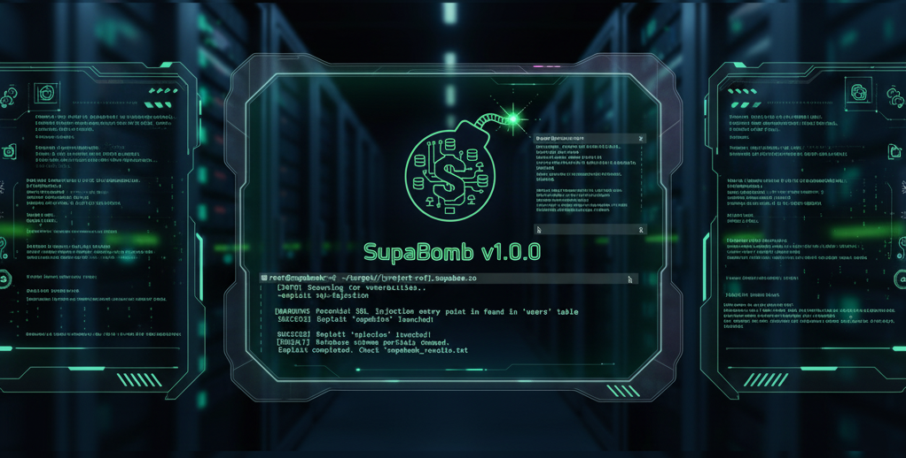

# Supabomb



A powerful CLI tool for discovering and pentesting Supabase instances in authorized security assessments.

## ✨ Features

- **Automatic Credential Caching**: Discovered credentials are automatically saved
  - No need to copy/paste project refs and API keys
  - Seamlessly reuse credentials across commands
  - Manage multiple projects easily

- **Discovery**: Find Supabase instances in web applications
  - Analyze HTML pages and JavaScript bundles
  - Extract project references and API keys
  - Parse HAR files from network traffic
  - **Katana Integration**: Deep web crawling for comprehensive discovery
    - Crawl entire website structure
    - Discover dynamically loaded JavaScript files
    - Extract edge function invocations with arguments
    - Analyze up to 50+ JS files per scan

- **Enumeration**: Discover available resources
  - List all accessible tables and columns
  - Enumerate RPC functions
  - Discover storage buckets
  - Test edge functions

- **Security Testing**: Identify misconfigurations
  - Test Row Level Security (RLS) policies
  - Compare anonymous vs authenticated data access
  - Check authentication configuration
  - Validate RPC function access controls
  - Test storage bucket permissions
  - Verify edge function JWT requirements

- **User Registration**: Test with authenticated access
  - Automatic random user generation
  - Support for email verification (with temporary emails)
  - Cached sessions for authenticated queries
  - Side-by-side comparison of anon vs auth row counts

- **Data Export**: Query and export data
  - Query tables with anonymous credentials
  - Export results in JSON or CSV format
  - Retrieve sample data for analysis

## 📦 Installation

Using uv (recommended):

```bash
cd supabomb
uv pip install -e .
# Or run directly:
uv run supabomb --help
```

## 🚀 Usage

### Quick Workflow

The typical workflow is simple:

```bash
# 1. Discover Supabase instance (credentials are auto-saved)
supabomb discover --url https://example.com

# 2. Use any command without providing credentials again
supabomb enum           # Enumerate resources
supabomb test           # Run security tests
supabomb query -t users # Query tables
```

### 🔍 Discover Supabase Instances

```bash
# From a web URL (standard single-page analysis)
supabomb discover --url https://example.com

# Deep crawl with Katana (recommended for SPAs and complex sites)
supabomb discover --url https://example.com --katana

# Katana with custom settings
supabomb discover --url https://example.com --katana --max-js-files 100 --verbose

# Katana with extended timeout for large sites
supabomb discover --url https://example.com --katana --katana-timeout 300

# From a JavaScript file
supabomb discover --file bundle.js

# From HAR file
supabomb discover --har network-traffic.har
```

**Katana Discovery Benefits:**
- Discovers ALL JavaScript files, including lazy-loaded and code-split bundles
- Executes JavaScript to find dynamic routes and imports
- Filters for target domain + Supabase API calls
- Aggregates edge functions from multiple sources
- Provides comprehensive Single Page Application (SPA) coverage

### 📊 Enumerate Resources

```bash
# With explicit credentials
supabomb enum --project-ref abc123xyz --anon-key "eyJ..."

# Or use cached credentials from discovery
supabomb enum
```

### 💾 Query Tables

```bash
# Query with authenticated session (default if available)
supabomb query --table users --limit 100

# Force anonymous query (ignore authenticated session)
supabomb query --table users --use-anon

# Query and export to file
supabomb query -t posts -o posts.json
supabomb query -t comments -o comments.csv -f csv

# Or with explicit credentials
supabomb query --project-ref abc123xyz --anon-key "eyJ..." --table users
```

**Authentication behavior:**
- By default, uses authenticated session if available (from `supabomb signup`)
- Falls back to anonymous key if no session exists
- Use `--use-anon` flag to force anonymous query

### 🔒 Security Testing

```bash
# Uses cached credentials
supabomb test --output report.json

# Or with explicit credentials
supabomb test --project-ref abc123xyz --anon-key "eyJ..."
```

### ⚡ Check Edge Functions

```bash
# Uses cached credentials
supabomb check-jwt -e function1 -e function2

# Or with explicit credentials
supabomb check-jwt --project-ref abc123xyz --anon-key "eyJ..." -e function1
```

### 👤 User Registration and Authentication

Register users to test RLS policies with authenticated access:

```bash
# Basic signup (generates random email/password)
supabomb signup

# Signup with specific credentials
supabomb signup -e test@example.com --password MyPass123

# Automatic email verification (when required)
supabomb signup --verify-email
# This will:
# 1. Create a temporary email address
# 2. Register the user
# 3. Wait for verification email
# 4. Automatically verify the account
# 5. Login and save session to cache

# View full email contents during verification (debugging)
supabomb signup --verify-email --verbose
# Shows:
# - Email check attempts
# - Full HTML and text content
# - All links found in email
# - Link extraction process
```

Once registered, authenticated row counts will be shown in `enum` command:

```bash
supabomb enum
# Shows both "Anon Rows" and "Auth Rows" columns when session exists
```

### 🗂️ Manage Cached Credentials

```bash
# List all cached credentials
supabomb cached

# Remove specific project
supabomb cached --remove abc123xyz

# Clear all cached credentials
supabomb cached --clear
```

## ⚖️ Legal & Ethical Use

**WARNING**: This tool is designed for authorized security testing only.

- Only test systems you own or have explicit permission to test
- Follow responsible disclosure practices
- Never test systems without authorization
- Never exfiltrate sensitive personal data

Unauthorized access to computer systems is illegal.

## 🏗️ Architecture

```
supabomb/
├── src/supabomb/
│   ├── cli.py                    # Click-based CLI
│   ├── client.py                 # Supabase API client
│   ├── discovery.py              # Web discovery & Katana integration
│   ├── enumeration.py            # Resource enumeration
│   ├── testing.py                # Security testing
│   ├── cache.py                  # Credential caching
│   ├── models.py                 # Data models
│   ├── katana_integration.py    # Katana web crawler integration
│   ├── edge_function_parser.py  # Edge function extraction
│   ├── output_formatting.py     # CLI output formatting
│   ├── signup_handler.py        # User registration workflow
│   ├── write_testing.py         # Write permission testing
│   ├── jwt_utils.py             # JWT token utilities
│   ├── email_utils.py           # Email verification utilities
│   ├── url_utils.py             # URL extraction utilities
│   ├── extraction_utils.py      # Data extraction utilities
│   └── formatting_utils.py      # Text formatting utilities
├── .supabomb.json                # Cached credentials (auto-generated)
└── pyproject.toml
```

## 📚 Dependencies

### Python Dependencies
- click: CLI framework
- requests: HTTP client
- beautifulsoup4: HTML parsing
- rich: Terminal formatting
- pyjwt: JWT token handling
- mailtm-python: Temporary email for verification (mail.tm)

### External Tools (Optional)
- **Katana**: Web crawler for deep JavaScript discovery
  ```bash
  # Install using Go
  go install github.com/projectdiscovery/katana/cmd/katana@latest

  # Verify installation
  katana -version
  ```

  **Note**: Katana is optional. If not installed, the `--katana` flag will show a helpful error message with installation instructions.

Made for security researchers, by security researchers.
